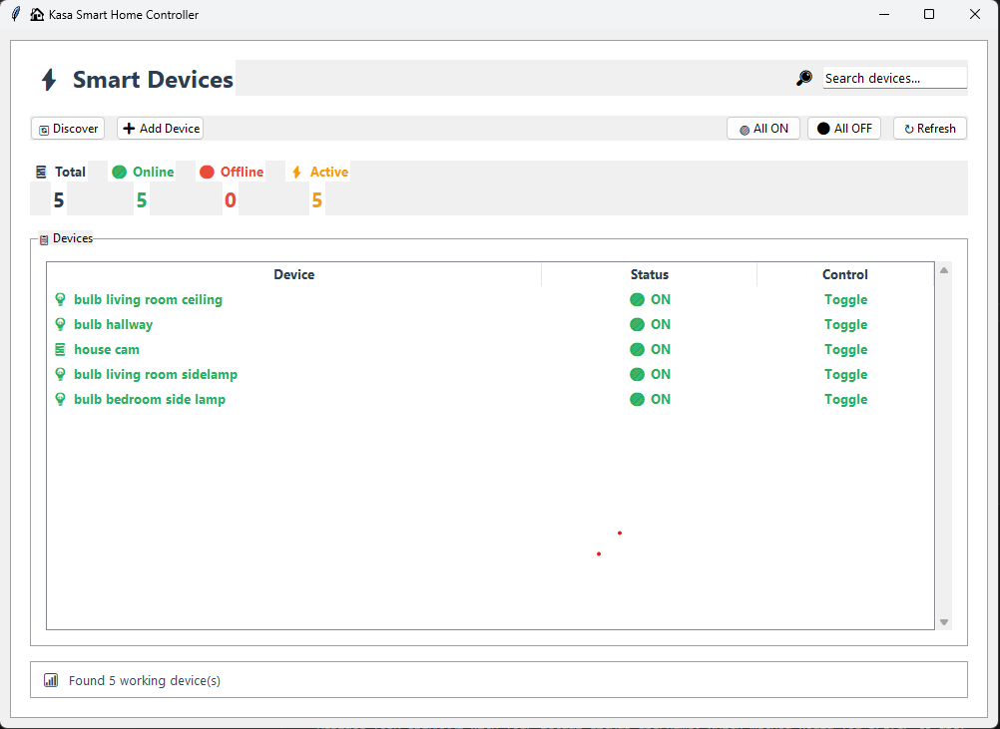

# ⚡ Smart Device Controller

A modern, minimal GUI application for controlling TP-Link Kasa smart home devices built with Python and Tkinter.



## ✨ Features

### 🎯 **Device Management**
- **Auto Discovery**: Automatically find Kasa devices on your network
- **Manual Addition**: Add devices by IP address
- **Real-time Status**: Live device status with color-coded indicators
- **Bulk Controls**: Turn all devices ON/OFF with one click

### 🎨 **Modern Interface**
- **Minimal Design**: Clean, distraction-free interface
- **Color-Coded Status**: Green for ON devices, Red for OFF devices
- **Device Icons**: Visual icons for different device types (💡 bulbs, 🔌 plugs, ⚡ switches)
- **Statistics Dashboard**: Live counts of total, online, offline, and active devices

### 🔍 **Smart Features**
- **Search & Filter**: Real-time device search functionality
- **Double-click Toggle**: Quick device control via double-click
- **Error Handling**: Robust error handling with user-friendly messages

## 🛠️ Installation

### Prerequisites
- Python 3.8 or higher
- Windows, macOS, or Linux

### Setup

1. **Clone the repository:**
   ```bash
   git clone <repository-url>
   cd ioswitch
   ```

2. **Install dependencies:**
   ```bash
   pip install python-kasa
   ```

3. **Set up credentials (optional):**
   ```bash
   cp .env.example .env
   # Edit .env with your Kasa credentials if needed
   ```

4. **Run the application:**
   ```bash
   python switch.py
   ```

## ⚙️ Configuration

### Environment Variables

Create a `.env` file for device credentials (required for newer Kasa devices):

```env
# For newer Kasa devices that require authentication
KASA_USERNAME=your_kasa_username
KASA_PASSWORD=your_kasa_password

# Leave empty if your devices don't require authentication
# KASA_USERNAME=
# KASA_PASSWORD=
```

## 🎮 Usage

### Getting Started
1. **Launch the app**: Run `python switch.py`
2. **Discover devices**: Click "🔄 Discover" to find devices on your network
3. **Control devices**: Double-click any device to toggle ON/OFF
4. **Bulk control**: Use "🟢 All ON" or "⚫ All OFF" for all devices

### Device Types Supported
- 🔌 **Smart Plugs**: Standard on/off control
- 💡 **Smart Bulbs**: On/off control (brightness/color via device app)
- ⚡ **Smart Switches**: Wall switch control
- 🔗 **Power Strips**: Multi-outlet control

### Interface Elements
- **📱 Total**: Total number of discovered devices
- **🟢 Online**: Devices currently reachable
- **⚫ Offline**: Devices not responding
- **⚡ Active**: Devices currently turned ON

## 🖥️ Platform Support

### Windows
- Native Windows 10/11 support
- Built-in tkinter support
- Recommended for best experience

### Raspberry Pi
Perfect for home automation hubs:
```bash
sudo apt update
sudo apt install python3-pip python3-tk
pip3 install python-kasa
python3 switch.py
```

**For headless Pi setup:**
- Enable VNC for remote GUI access
- Use SSH with X11 forwarding: `ssh -X pi@your-pi-ip`

### macOS/Linux
Standard Python/tkinter installation works out of the box.

## 🔧 Development

### Project Structure
```
ioswitch/
├── switch.py          # Main application
├── .env.example       # Environment template
├── .gitignore         # Git ignore rules
└── README.md          # This file
```

### Key Components
- **KasaDeviceGUI**: Main application class
- **Device Discovery**: Async network scanning
- **Credential Management**: Environment-based auth
- **UI Styling**: Modern TTK themes with color coding

## 🔒 Security

- Credentials stored only in local `.env` file
- No network data transmission beyond local network
- Secure async timeouts prevent hanging connections
- Input validation for IP addresses

## 📝 Requirements

- `python-kasa` - TP-Link Kasa device communication
- `tkinter` - GUI framework (usually included with Python)
- `asyncio` - Async device operations
- `threading` - Background task management

## 🐛 Troubleshooting

### Common Issues

**"No devices found"**
- Ensure devices are on the same network
- Check if devices require credentials (newer models)
- Verify network connectivity

**"Module not found: tkinter"**
- Linux: `sudo apt install python3-tk`
- Windows: Reinstall Python with "tcl/tk and IDLE" option

**Devices not responding**
- Check device power and network connection
- Try manual addition with IP address
- Restart the application

## 🤝 Contributing

1. Fork the repository
2. Create a feature branch
3. Make your changes
4. Test thoroughly
5. Submit a pull request

## 📄 License

This project is open source. Feel free to use, modify, and distribute.

## 🙏 Acknowledgments

- Built with [python-kasa](https://github.com/python-kasa/python-kasa) library
- UI icons from Unicode emoji set
- Inspired by modern home automation interfaces

---

**Made for smart home enthusiasts who want simple, reliable device control.** 🏠✨